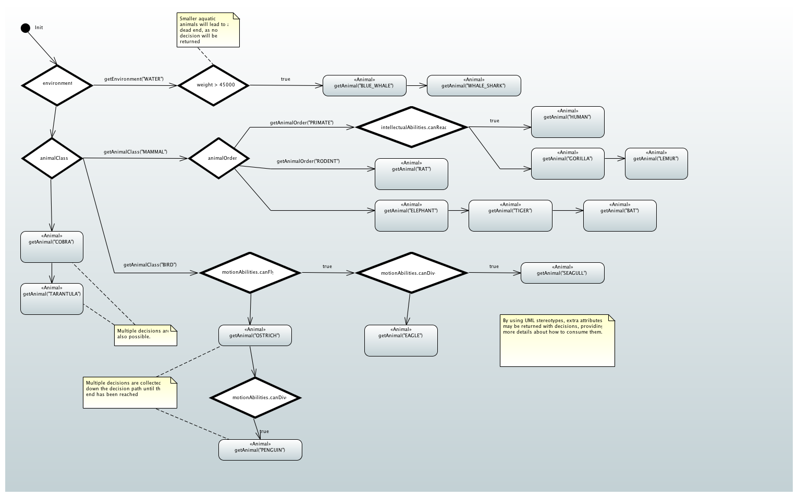

# Decision Flow

* [How to go about](#how-to-go-about)
* [The Zoo Example](#the-zoo-example)
* [Usage](#usage)
* [Papyrus UML Tool](#papyrus-uml-tool)

The purpose of this Java library is to facilitate developing systems that make dynamic 
(runtime) decisions without too much of hard-coding.

## How to go about?

1. Create your context class, i.e. a container that has all the properties and all the 
methods that have a say in your decision making.
2. Create a state-machine like diagram that describes your decision making in detail. This 
is normally done with the help of a UML tool, using expressions that involve the properties 
and the methods from your context class.
3. If you are OK with using Papyrus as the tool of choice in 2, skip this step. Otherwise, 
implement DecisionFlowDescriber interface in order to "teach" the library to load the 
diagram created in 2.
4. Create an instance of DecisionFlow with the help of the instance created in 3.
5. Invoke getDecision() (or getDecisions()) method with an instance of your context class 
as the only parameter.
6. Consume decision(s) returned by getDecision(s)(). 
7. To make the consumption of the decisions more fine-grained, you may want to invoke Decision.getAttributes() for additional information stored in your diagram.
 
> (Regarding 7) Attribute values will be attempted computed as expressions within
the context from 1. If the computation is unsuccessful, they will be returned as plain 
strings.  

## The Zoo Example

For the details about how to use this library, please refer to the Zoo example found in the 
unit tests.

> OBS.: Unit tests are the only way to check your diagrams for sanity prior to deploying
them!

The example diagram used in the unit tests:

## Usage

The class that "does the job" has the following signature:

	public class DecisionFlow<C, P> implements DecisionMachine<C, P> {
	...
	}

- C - the class you want to use for your context.
- P - the class of your payload.

Having that on mind, your client code may look like the following:

	DecisionFlowDescriber describer = Papyrus.getInstance("path/to/uml/file");
	DecisionFlow<MyContext, MyPayloadClass> flow = DecisionFlow.getInstance(describer);
	
	MyContext context = new MyContext(...);
	Decision<MyPayloadClass> decision = flow.getDecision(context);
	// obs.: decision may be null, indicating a dead-end in your flow
	MyPayloadClass payload = decision.getPayload();
	
	// obs.: if no attributes registered in the diagram, getAttributes() will return null
	String aValue = decision.getAttributes().get("aKey");
	String anotherValue = decision.getAttributes().get("anotherKey");

If you want multiple decisions to be returned, do the following:

	List<Decision<MyPayloadClass>> decisions = flow.getDecisions(context);
	
In the previous example, you may want to replace the Papyrus describer with the one you 
actually use.

Furthermore, please refer to the unit tests for the nitty-gritty of the usage of this 
library.

## Papyrus UML Tool

Papyrus is an open-source UML tools based on Eclipse, but you don't have to download 
Eclipse in order to use Papyrus. Since a decision flow loader for Papyrus is already 
implemented by this library, you may find Papyrus convenient to start with.

As an additional convenience, you may want to include the whole Papyrus workspace that 
contains your diagrams in the SCM you use. In this manner, the changes you make in your 
diagrams will be both version-controlled and immediately consumable by your client code 
without additional steps.   

In order to keep your Papyrus diagram "loadable" by this library, please adhere to the 
following rules:

1. Use state machine kind of diagram in Papyrus.
2. Always begin diagrams with an Initial node.
3. Use Transition elements to connect nodes. The nodes that are not connected will be 
ignored by DecisionFlow.
4. Use Choice elements to decide where to go next. Use their labels to declare expressions
that will be used to compute the next step (see 6).
5. Use State elements to mark your final decision(s). Note that multiple decisions are 
also supported. 
6. Use labels to define expressions that are to be computed within your context. This 
applies to Choice, Transition and State elements.
7. Because of 6, make sure all the elements that use expressions have different names. 
Unfortunately labels are associated with element names in Papirus, not their ids. If you 
fail to follow this rule, a runtime exception will be thrown while loading the diagram.
8. Make sure the expressions you use with your State elements compute to the same type 
as your payload (i.e. the parameter P you used when creating DecisionFlow<C, P>). For 
example, if your payload is of type String, make sure your expressions are legal Java 
String literals (remember double quotes!). Or another example: if your payload is an enum, 
make sure your context class include a static method that resolves enums on the basis of 
their names. If you fail to follow this rule, getDecision(s) will throw a runtime 
exception. 
9. Use UML Stereotypes as a means to register additional attributes to your States. These 
attributes will be made consumable by the caller of getDecision(s)().

Please refer to the Zoo example diagram for further details.
